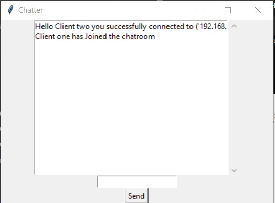
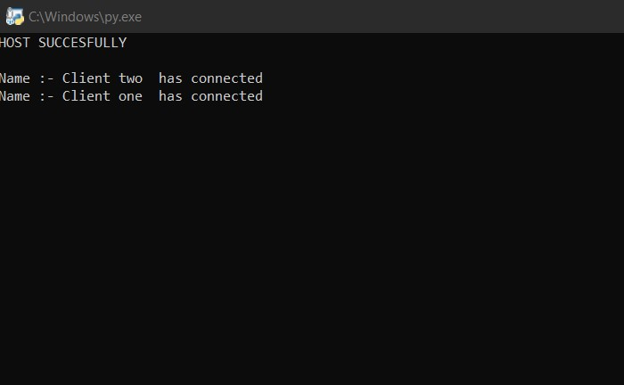

# Simple-Chatroom-using-Python-socket-
A simple GUI multi client system using python , Tkinter and Socket

#  Prerequisites

1 Tkinter

2 Socket

# Usage

First you need to execute the Host.py python file (It is a host file while hosts you can also change the  IP address + Port  in the 6th line *IF THERE IS A SOFTWARE THAT ALREADY USING THE SAME PORT)

After the just simply run the other 2 files named Client-1.py and Client-2.py) 

You can also cahnge the client name in the 49th line of client python file 

Now you can see client names in the HOST terminal 

## CHAT 

